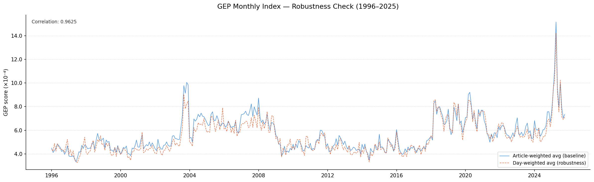
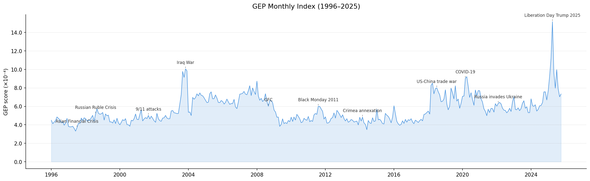
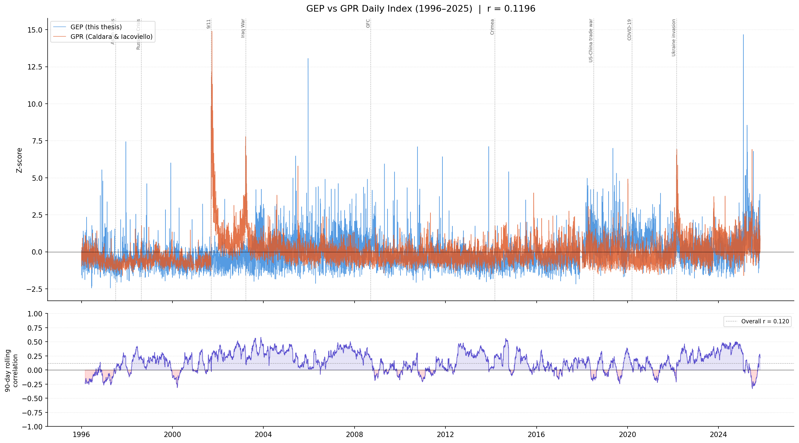
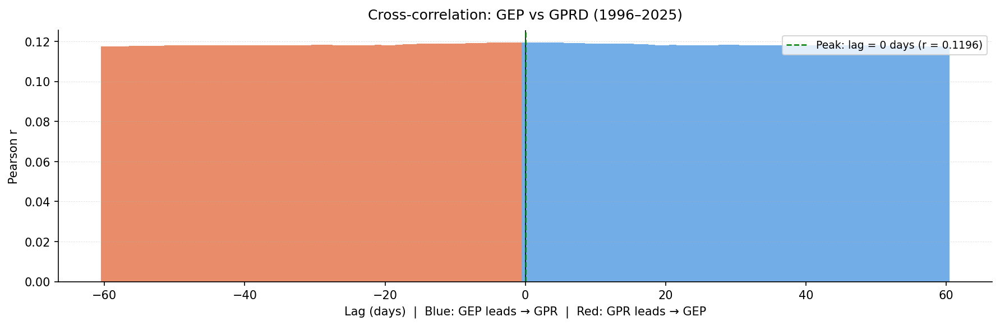

# Master Thesis — Caterina Piacentini
## The Geoeconomic Impact on Stock Market Indices
### WU Vienna University of Economics and Business

---

## Overview

This thesis constructs a novel **Geoeconomic Pressure (GEP) Index** from Reuters newswire text (1996–2025) using a fully data-driven NLP pipeline. The index quantifies the daily intensity of geoeconomic stress — trade wars, sanctions, export controls, tariffs, financial coercion, retaliation, protectionism, and embargoes — and is used to study its impact on stock market indices.

The methodology follows and extends Dangl & Salbrechter (2023), combining **Word2Vec embeddings**, **Guided Topic Modeling (GTM)**, and a **weighted dictionary scoring** approach.

---

## Pipeline

### Step 1 — Data & Cleaning

**Corpus:** Reuters newswire articles (1996–2025), stored as yearly compressed files (`rtrs_YYYY_clean.txt.gz` for text, `rtrs_YYYY_meta.jsonl.gz` for metadata).

The cleaning pipeline (`scripts/cleaning/Cleaning_All_US.py`) preprocesses the raw corpus:
- Lowercasing and punctuation removal
- Boilerplate and diary entry removal
- Bigram detection and concatenation (e.g. `trade_war`, `economic_sanctions`)
- Output: one cleaned `.txt.gz` per year, one article per line

---

### Step 2 — Word2Vec Training

**Script:** `scripts/training/word2vec & GTM/train_w2v_all.py`
**SLURM:** `slurm/train_w2v_all.slurm`

A Word2Vec model is trained on the full cleaned corpus (1996–2025) using the **CBOW** architecture, following the hyperparameters of Dangl & Salbrechter (2023):

| Hyperparameter | Value |
|---|---|
| Architecture | CBOW (`sg=0`) |
| Embedding dimension | 64 |
| Context window | 18 |
| Min word count | 20 |
| Negative samples | 10 |
| Subsampling threshold | 1×10⁻⁵ |
| Training epochs | 50 |

After training, embeddings are PCA-reduced to 64 dimensions and saved as a `.pkl` dictionary (`word → vector`) for use by the GTM.

**Output model:** `w2v_cbow_64_window_18_50_epochs_1996_2025.pkl`

---

### Step 3 — Guided Topic Modeling (GTM-8)

**Script:** `scripts/training/word2vec & GTM/GTM_8.py`
**SLURM:** `slurm/gtm_8_slurm.slurm`

The GTM algorithm (Dangl & Salbrechter 2023) extracts topic-specific word clusters from the Word2Vec embedding space. Starting from hand-chosen **seed words**, it iteratively recruits the vocabulary words with the smallest cosine angle to the current topic subspace, using a **gravity** parameter to progressively down-weight seed words and let the topic grow organically.

**GTM hyperparameters:**

| Parameter | Value | Meaning |
|---|---|---|
| `cluster_size` | 100 | Max words per topic |
| `gravity` | 1.5 | Rate at which seed word influence decays |
| `alpha_max` | 2.0 | Stopping criterion (max angle in radians) |
| `k-similar` | 5,000 | FAISS neighbourhood size for candidate search |

**Similarity search** uses FAISS IVF-Flat indexing for efficient approximate nearest-neighbour retrieval over the full vocabulary.

#### The 8 Geoeconomic Sub-Topics

Eight sub-dimensions of geoeconomic pressure were identified and modelled. Each topic is seeded with two positive anchor bigrams (clearly in-topic) and one or two negative seed words (pushed away from the topic direction):

| # | Topic | Positive seeds | Negative seeds |
|---|---|---|---|
| 1 | **Sanctions** | `economic_sanctions`, `sanctions_regime` | `sanctions_relief`, `sanctions_waiver` |
| 2 | **Trade War** | `trade_war`, `trade_conflict` | `trade_deal`, `trade_pact` |
| 3 | **Export Controls** | `export_ban`, `export_restriction` | `export_license` |
| 4 | **Tariffs** | `import_tariff`, `customs_duty` | `free_trade`, `tariff_exemption` |
| 5 | **Financial Coercion** | `asset_freeze`, `frozen_assets` | `debt_relief` |
| 6 | **Retaliation** | `retaliation`, `retaliatory_measures` | `concessions`, `goodwill_gesture` |
| 7 | **Protectionism** | `protectionism`, `import_quota` | `trade_liberalization` |
| 8 | **Embargo** | `trade_embargo`, `oil_embargo` | `lift_embargo` |

Each topic run produces:
- `topic_<Name>.csv` — ranked word list with GTM weights
- `WordClouds/topic_<Name>.png` — 1920×1080 word cloud
- `log_topic_<Name>.txt` — full log with seed words and per-word angles

A combined 2×4 grid of all word clouds is also generated: `Combined_Geoeconomic_Pressure_Grid_8.png`.

**Output:** `GTM_different_versions/GTM8_results/`

---

### Step 4 — Dictionary Construction

**Script:** `scripts/training/dict & score/build_dictionary_8.py`
**SLURM:** `slurm/build_dict_8.slurm`

The 8 topic CSVs are consolidated into a single **geoeconomic dictionary** following Dangl & Salbrechter (2023, Eq. 10):

1. **Local normalization:** within each topic, weights are scaled to [0, 1] by dividing by the topic maximum. This ensures no single sub-dimension dominates due to scale differences.

2. **Global aggregation:** for each word, the mean normalized weight across all Q = 8 topics is computed:

$$w_{\text{global}}(v) = \frac{1}{Q} \sum_{q=1}^{Q} \tilde{w}_q(v)$$

Words appearing in multiple topics receive proportionally higher global weight, reflecting their cross-dimensional relevance.

**Output:** `DICTIONARY/geoeconomic_dictionary.csv` — columns: `word`, `weight`, `topic_count`, `topics`

---

### Step 5 — Daily GEP Index

**Script:** `scripts/training/dict & score/score_daily_index_new.py`
**SLURM:** `slurm/score_daily_index_new.slurm`

Each article is scored against the geoeconomic dictionary. The **per-article score** is:

$$\text{score}_i = \frac{\sum_{w \in V} \min(\text{count}_{i,w},\ 4) \times T(w)}{N_i}$$

where $T(w)$ is the dictionary weight, $\text{count}_{i,w}$ is the raw word frequency in article $i$, 4 is the **frequency cap** (prevents a single high-frequency keyword from dominating; Dangl & Salbrechter 2023), and $N_i$ is the total word count of article $i$.

**Daily aggregation:**

| Field | Definition |
|---|---|
| `score` | Mean article score (geoeconomic intensity) |
| `score_volume` | Sum of article scores (total daily GEP signal mass) |
| `n_articles` | Total articles published that day |
| `n_gep_articles` | Articles with score > 0 |

Gap days (weekends, holidays) are filled by forward-carrying the last observed score; volume and article counts are set to 0.

**Coverage:** 10,897 calendar days (1996–2025), of which 10,814 are true trading days with articles.

**Output:** `INDEX/index_8/GEP_Daily_Index.csv`

---

### Step 6 — Monthly GEP Index

Two versions of the monthly index are computed, enabling a **robustness check**:

#### Baseline — Article-Weighted Average
The monthly GEP score is a weighted average of daily scores, weighted by article count. This is equivalent to averaging over all individual articles in the month:

$$\text{GEP}_m^{\text{baseline}} = \frac{\sum_{t \in m} \text{score}_t \times N_t}{\sum_{t \in m} N_t}$$

Computed inside `score_daily_index_new.py`. **Output:** `INDEX/index_8/GEP_Monthly_Index.csv`

#### Robustness — Day-Weighted Average
**Script:** `scripts/training/dict & score/compute_monthly_robustness.py`
**SLURM:** `slurm/plot_robustness_check_GEP.slurm`

Each trading day is weighted equally, regardless of article volume:

$$\text{GEP}_m^{\text{robustness}} = \frac{1}{T_m} \sum_{t \in m} \text{score}_t$$

Gap-filled days (`n_articles == 0`) are excluded from the average. **Output:** `INDEX/index_8/GEP_Monthly_Robustness.csv`

#### Robustness Check Plot
**Script:** `INDEX/index_8/robustness_check_GEP.py`

Both monthly series are plotted together to verify robustness. The two series are very highly correlated (r = 0.9625), confirming that the index is not driven by a few high-volume days.



---

### Step 7 — GEP Monthly Index (Baseline Plot)

**Script:** `INDEX/index_8/plotting_index_8.py`

The baseline monthly GEP index is plotted over 1996–2025 with key geopolitical and geoeconomic events annotated.



---

## GEP vs GPR: Comparison & Validation

**Script:** `INDEX/index_8/gep_vs_gprd_comparison.py`

The GEP index is compared against the **daily Geopolitical Risk (GPR) index** of Caldara & Iacoviello (2022) to assess co-movement and relative predictive power.

**Scaling note:** GPRD is normalised to 100 (1985–2019 average); GEP is a raw weighted word frequency (~10⁻⁴). Both series are **z-scored** before any comparison.

#### Co-movement

| Period | Pearson r |
|---|---|
| 1996–2001 | 0.062 |
| 2002–2009 | 0.000 |
| 2010–2019 | 0.073 |
| 2020–2025 | 0.109 |
| **Overall** | **0.120** |

The low but consistently significant correlation reflects that GEP and GPR measure **related but distinct phenomena**: GEP captures geoeconomic coercion (trade, sanctions, financial pressure) while GPR captures geopolitical threat and military risk. They align most during extreme events where both dimensions escalate simultaneously (e.g. Ukraine invasion, COVID-19).

#### Granger Causality (max lag = 5 trading days)

| Direction | Lag | F-stat | p-value |
|---|---|---|---|
| GEP → GPR | 2 | 52.7 | < 0.001 ★ |
| GEP → GPR | 3 | 35.2 | < 0.001 ★ |
| GEP → GPR | 4 | 24.4 | < 0.001 ★ |
| GEP → GPR | 5 | 20.8 | < 0.001 ★ |
| GPR → GEP | 4 | 2.5 | 0.040 ★ |
| GPR → GEP | 5 | 4.2 | < 0.001 ★ |

**GEP Granger-causes GPR** strongly at lags 2–5 days. The reverse is true only weakly and at longer lags. This suggests that geoeconomic stress (trade tensions, sanctions escalation) tends to **precede** broader geopolitical risk — economic coercion builds before conflicts fully materialise in the news cycle.




---

## Repository Structure

```
Master_Thesis/
│
├── scripts/
│   ├── cleaning/
│   │   └── Cleaning_All_US.py          # Corpus preprocessing & bigram detection
│   └── training/
│       ├── word2vec & GTM/
│       │   ├── train_w2v_all.py        # Word2Vec training (CBOW, dim=64, window=18)
│       │   └── GTM_8.py               # Guided Topic Modeling (8 topics)
│       └── dict & score/
│           ├── build_dictionary_8.py   # Consolidate GTM topics → weighted dictionary
│           ├── score_daily_index_new.py # Score corpus → GEP Daily + Monthly Index
│           └── compute_monthly_robustness.py  # Day-weighted monthly robustness index
│
├── slurm/                              # SLURM job scripts for WU cluster
│   ├── Clean_ALL_US.slurm
│   ├── train_w2v_all.slurm
│   ├── gtm_8_slurm.slurm
│   ├── build_dict_8.slurm
│   ├── score_daily_index_new.slurm
│   └── plot_robustness_check_GEP.slurm
│
├── GTM_different_versions/
│   └── GTM8_results/                  # Final GTM results (8 topics)
│       ├── topic_Sanctions.csv
│       ├── topic_Trade_War.csv
│       ├── topic_Export_Controls.csv
│       ├── topic_Tariffs.csv
│       ├── topic_Financial_Coercion.csv
│       ├── topic_Retaliation.csv
│       ├── topic_Protectionism.csv
│       ├── topic_Embargo.csv
│       ├── WordClouds/                # Word cloud PNGs per topic
│       └── Combined_Geoeconomic_Pressure_Grid_8.png
│
├── DICTIONARY/
│   └── geoeconomic_dictionary.csv     # Final weighted word list (Q=8 topics)
│
└── INDEX/
    └── index_8/
        ├── GEP_Daily_Index.csv        # Daily GEP scores (1996–2025)
        ├── GEP_Monthly_Index.csv      # Monthly GEP — article-weighted (baseline)
        ├── GEP_Monthly_Robustness.csv # Monthly GEP — day-weighted (robustness)
        ├── GEP_Monthly_Index.png      # Baseline monthly plot
        ├── robustness_check_GEP.png   # Robustness comparison plot
        ├── gep_vs_gprd_timeseries.png # GEP vs GPR time series + rolling corr
        └── gep_vs_gprd_crosscorr.png  # GEP vs GPR cross-correlation
```

---

## Cluster Setup (WU HPC)

All computationally intensive steps run on the WU Vienna HPC cluster (`wucluster`) via SLURM. The cluster uses a Python virtual environment at `~/venvs/rtrs_w2v/` with all required packages.

**Sync workflow:**
```bash
# Push local changes → cluster
git add . && git commit -m "..." && git push
ssh wucluster "git -C ~/Master_Thesis pull"

# Pull cluster results → local
git pull
```

---

## References

- Dangl, T., Halling, M. & Salbrechter, S. (2025). *The Price of Physical Climate Risk Estimated from Public News via Guided Topic Modeling*. October 11, 2025.
- - Dangl, T. & Salbrechter, S. (2025). *Guided Topic Modeling with Word2Vec: A Technical Note*. First draft, September 19, 2023.
- Caldara, D. & Iacoviello, M. (2022). *Measuring Geopolitical Risk*. American Economic Review, 112(4), 1194–1225.
