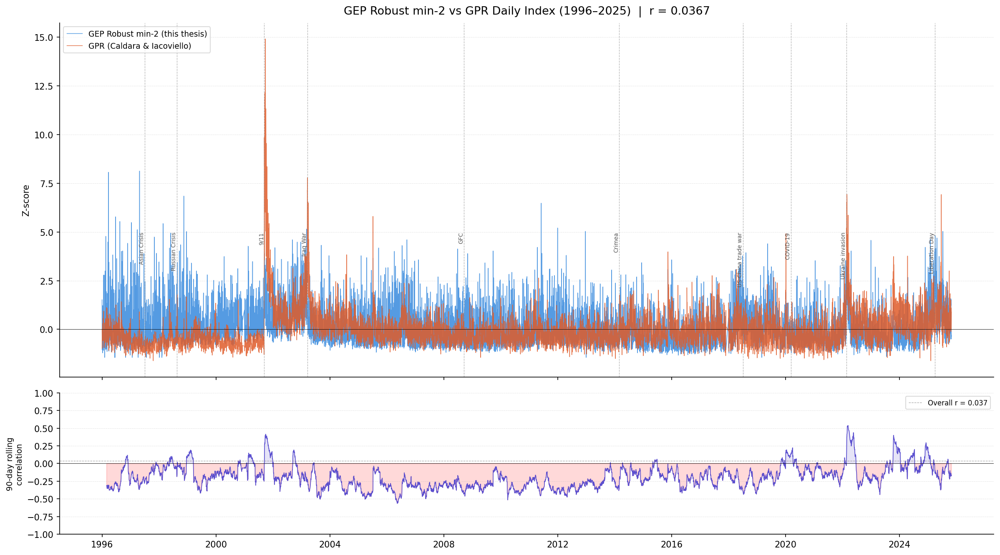
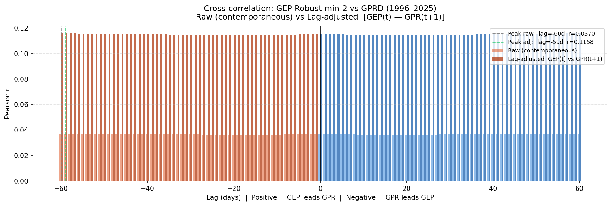

# Master Thesis — Caterina Piacentini
## The Geoeconomic Impact on Stock Market Indices
### WU Vienna University of Economics and Business

---

## Overview

This thesis constructs a novel **Geoeconomic Pressure (GEP) Index** from Reuters newswire text (1996–2025) using a fully data-driven NLP pipeline. The index quantifies the monthly share of news coverage devoted to geoeconomic stress — trade coercion, sanctions, export controls, financial coercion, retaliation, and embargoes — and is used to study its impact on the S&P 500.

The methodology follows and extends Dangl & Salbrechter (2023), combining **Word2Vec embeddings**, **Guided Topic Modeling (GTM)**, and a **threshold-based article classification** approach.

**Final deliverables:** GTM-6 new final topic model (`GTM_different_versions/GTM_new_final_results/`) and the MIN2 robust index (`INDEX/index_new_final/MIN2/`).

---

## Pipeline

### Step 1 — Data & Cleaning

**Corpus:** Reuters newswire articles (1996–2025), stored as yearly compressed files.

The cleaning pipeline (`scripts/cleaning/Cleaning_All_US.py`) preprocesses the raw corpus:
- Lowercasing and punctuation removal
- Boilerplate and diary entry removal
- Bigram detection and concatenation (e.g. `trade_war`, `economic_sanctions`)
- Output: one cleaned `.txt.gz` per year, one article per line

---

### Step 2 — Word2Vec Training

**Script:** `scripts/training/word2vec & GTM/train_w2v_all.py`

A Word2Vec model is trained on the full cleaned corpus (1996–2025) using the **CBOW** architecture:

| Hyperparameter | Value |
|---|---|
| Architecture | CBOW (`sg=0`) |
| Embedding dimension | 64 |
| Context window | 18 |
| Min word count | 20 |
| Negative samples | 10 |
| Training epochs | 50 |

**Output model:** `w2v_cbow_64_window_18_50_epochs_1996_2025.pkl`

---

### Step 3 — Guided Topic Modeling (GTM-6, New Final)

**Script:** `scripts/training/word2vec & GTM/GTM_8.py`
**Output:** `GTM_different_versions/GTM_new_final_results/`

The GTM algorithm iteratively expands six geoeconomic sub-topics from seed words in the 64-dimensional embedding space. The final model consolidates the previous 8-topic structure into **6 sharper, better-separated topics** by merging Trade War, Tariffs, and Protectionism into a single **Trade Coercion** dimension.

**GTM hyperparameters:**

| Parameter | Value |
|---|---|
| `cluster_size` | 100 words per topic |
| `gravity` | 1.5 |
| `alpha_max` | 2.0 rad |
| `k-similar` | 5,000 (FAISS) |

#### The 6 Geoeconomic Sub-Topics (New Final)

| # | Topic | Positive seeds | Negative seeds |
|---|---|---|---|
| 1 | **Sanctions** | `economic_sanctions`, `targeted_sanctions` | `sanctions_relief`, `sanctions_waiver` |
| 2 | **Trade Coercion** | `trade_war`, `retaliatory_tariffs` | `trade_deal`, `trade_pact` |
| 3 | **Export Controls** | `export_ban`, `entity_list` | `export_license`, `export_licenses` |
| 4 | **Financial Coercion** | `asset_freeze`, `secondary_sanctions` | `debt_relief` |
| 5 | **Retaliation** | `retaliation`, `countermeasures` | `concessions`, `goodwill_gesture` |
| 6 | **Embargo** | `trade_embargo`, `oil_embargo` | `lift_embargo`, `lifting_sanctions` |

**Key change from previous version:** Trade War, Tariffs, and Protectionism are consolidated into *Trade Coercion* (`trade_war` + `retaliatory_tariffs` as seeds). This produces a cleaner, more coherent topic that captures the full spectrum of coercive trade pressure without fragmentation.

**Output per topic:** `topic_<Name>.csv` (ranked word list with GTM weights), word cloud PNG, log file.
Combined word cloud grid: `Combined_GEP_Grid_6.png`

---

### Step 4 — Dictionary Construction

**Script:** `scripts/training/dict & score/build_dictionary_8.py`

The 6 topic CSVs are consolidated into a single **geoeconomic dictionary** using local normalization per topic followed by global averaging across Q=6 topics (Dangl & Salbrechter 2023, Eq. 10):

$$w_{\text{global}}(v) = \frac{1}{Q} \sum_{q=1}^{Q} \tilde{w}_q(v)$$

Words appearing across multiple sub-topics receive proportionally higher weight, reflecting cross-dimensional geoeconomic relevance.

**Output:** `DICTIONARY/geoeconomic_dictionary_new.csv`

---

### Step 5 — GEP Index: MIN-K Threshold Construction (New Final)

**Script:** `scripts/training/dict_score/score_daily_index_new.py`

#### Construction logic

The new index departs from the score-averaging approach of earlier versions. Instead of computing a continuous weighted score per article, the index measures the **share of daily news coverage explicitly devoted to geoeconomic pressure**:

$$\text{GEP}_m = \frac{n_{\text{GEP articles},\, m}}{n_{\text{articles},\, m}}$$

where an article is classified as a **GEP article** if it contains at least $K$ dictionary keywords:

$$\mathbf{1}[\text{GEP article}_i] = \mathbf{1}\!\left[\sum_{w \in V} \mathbf{1}[w \in \text{article}_i] \geq K\right]$$

#### Why this construction

| Property | Score-based (old) | MIN-K threshold (new) |
|---|---|---|
| Scale | Raw weighted freq (~10⁻⁴) | Proportion (0–1), interpretable |
| Stationarity | Non-stationary in levels; requires differencing | **Stationary in levels** (bounded ratio) |
| Robustness | Sensitive to high-frequency words | Threshold filters noise; requires co-occurrence |
| Regression use | Must use ΔGEP_z | Can use GEP_z directly in levels |

Because the MIN-K index is bounded in [0, 1] by construction, it cannot drift — confirmed by ADF tests. This allows using **GEP_z (levels) directly** as a regressor, preserving the economically meaningful intensity signal.

#### Robustness across thresholds

| Variant | Threshold K | Interpretation |
|---|---|---|
| MIN1 | ≥ 1 keyword | Broadest — any mention of a GEP word |
| **MIN2** | **≥ 2 keywords** | **Baseline (final)** — co-occurrence required |
| MIN3 | ≥ 3 keywords | Stricter — article must be substantially GEP-focused |
| MIN4 | ≥ 4 keywords | Most conservative |

**Final index: MIN2** (`INDEX/index_new_final/MIN2/`). Robustness variants in `INDEX/index_new_final/robustness/`.

**Output files:**
- `GEP_Daily_Robust_min2.csv` — daily GEP proportion (1996–2025)
- `GEP_Monthly_Robust_min2.csv` — monthly GEP proportion

---

## GEP vs GPR: Comparison & Validation

**Script:** `INDEX/index_new_final/MIN2/gep_vs_gpr_robust_min2.py`

The MIN2 GEP index is compared against the **Geopolitical Risk (GPR) index** of Caldara & Iacoviello (2022). Both series are z-scored before comparison.

The low but positive correlation confirms GEP and GPR measure **related but distinct phenomena**: GEP captures geoeconomic coercion (trade pressure, sanctions, financial weaponisation) while GPR captures geopolitical threat and military risk.




---

## Return Predictability Regressions

**Script:** `INDEX/index_new_final/MIN2/return_predictability_min2.R`

Monthly and quarterly OLS regressions of S&P 500 log returns on the MIN2 GEP index (z-scored levels), with Newey-West HAC standard errors. Four model specifications:

| Spec | Formula |
|---|---|
| m1 | `log_ret ~ GEP_z` |
| m2 | `log_ret ~ GEP_z + GPR_z` |
| m3 | `log_ret ~ GEP_z + GPR_z + MktRF + SMB + HML` |
| m4 | `log_ret ~ GEP_z + GEP_z_lag1 + GPR_z + GPR_z_lag1 + MktRF + SMB + HML` |

Run at **h=0** (contemporaneous) and **h=1** (next-period predictability), across the full sample and five subperiods.

### Key findings

**1. GEP is a contemporaneous indicator, not a predictor.** Results at h=1 are uniformly insignificant across all specifications and periods. GEP reflects market reactions to geopolitical events, not a leading signal.

**2. The sign of the GEP effect flips across regimes:**

| Period | Effect on returns | Interpretation |
|---|---|---|
| Pre-GFC (1996–2007) | Negative\* (m1: −0.009, m_rob: −0.017) | Geo news hurts markets contemporaneously |
| Post-GFC (2012–2021) | Positive\*\* conditional on FF3 (+0.0008) | Geopolitical risk premium — high GEP months earn more |
| Russia–Ukraine (2022–2023) | Negative\* (m2: −0.047) | Return to fear-driven reaction |

**3. GEP and GPR are complementary.** In Post-GFC, GPR_z loads *negatively* (−0.013\*) while GEP_z loads *positively* (+0.0008\*\*) after controlling for FF3. The two indices capture distinct asset pricing channels.

**4. No full-sample significance without factor controls.** In m1/m2, GEP_z is not significant in the full sample — the effect is regime-dependent and emerges only when market beta is controlled for.

**5. Quarterly results confirm monthly.** Pre-GFC quarterly: GEP_z = −0.028\* in m1. Full-sample quarterly m4: lagged GEP_z_lag1 = +0.0024\* — weak quarterly predictability.

---

## Repository Structure

```
Master_Thesis/
│
├── scripts/
│   ├── cleaning/
│   │   └── Cleaning_All_US.py
│   └── training/
│       ├── word2vec & GTM/
│       │   ├── train_w2v_all.py
│       │   └── GTM_8.py
│       └── dict_score/
│           ├── build_dictionary_8.py
│           └── score_daily_index_new.py
│
├── slurm/                              # SLURM job scripts (WU cluster)
│
├── GTM_different_versions/
│   └── GTM_new_final_results/         # FINAL — 6 topics
│       ├── topic_Sanctions.csv
│       ├── topic_Trade_Coercion.csv   # New: consolidates Trade War + Tariffs + Protectionism
│       ├── topic_Export_Controls.csv
│       ├── topic_Financial_Coercion.csv
│       ├── topic_Retaliation.csv
│       ├── topic_Embargo.csv
│       ├── WordClouds/
│       └── Combined_GEP_Grid_6.png
│
├── DICTIONARY/
│   └── geoeconomic_dictionary_new.csv
│
└── INDEX/
    └── index_new_final/
        ├── MIN2/                      # FINAL INDEX
        │   ├── GEP_Daily_Robust_min2.csv
        │   ├── GEP_Monthly_Robust_min2.csv
        │   ├── GEP_Monthly_Robust_min2.png
        │   ├── GEP_Monthly_Robust_min2_norm100.png
        │   ├── gep_vs_sp500_robust_min2.py
        │   ├── gep_vs_gpr_robust_min2.py
        │   └── return_predictability_min2.R
        └── robustness/
            ├── MIN1/                  # Threshold K=1 (broad)
            ├── MIN3/                  # Threshold K=3 (strict)
            └── MIN4/                  # Threshold K=4 (most conservative)
```

---

## Cluster Setup (WU HPC)

All computationally intensive steps run on the WU Vienna HPC cluster (`wucluster`) via SLURM.

```bash
# Push local changes → cluster
git add . && git commit -m "..." && git push
ssh wucluster "git -C ~/Master_Thesis pull"

# Pull cluster results → local
git pull
```

---

## References

- Dangl, T., Halling, M. & Salbrechter, S. (2025). *The Price of Physical Climate Risk Estimated from Public News via Guided Topic Modeling*. October 11, 2025.
- Dangl, T. & Salbrechter, S. (2023). *Guided Topic Modeling with Word2Vec: A Technical Note*. First draft, September 19, 2023.
- Caldara, D. & Iacoviello, M. (2022). *Measuring Geopolitical Risk*. American Economic Review, 112(4), 1194–1225.
